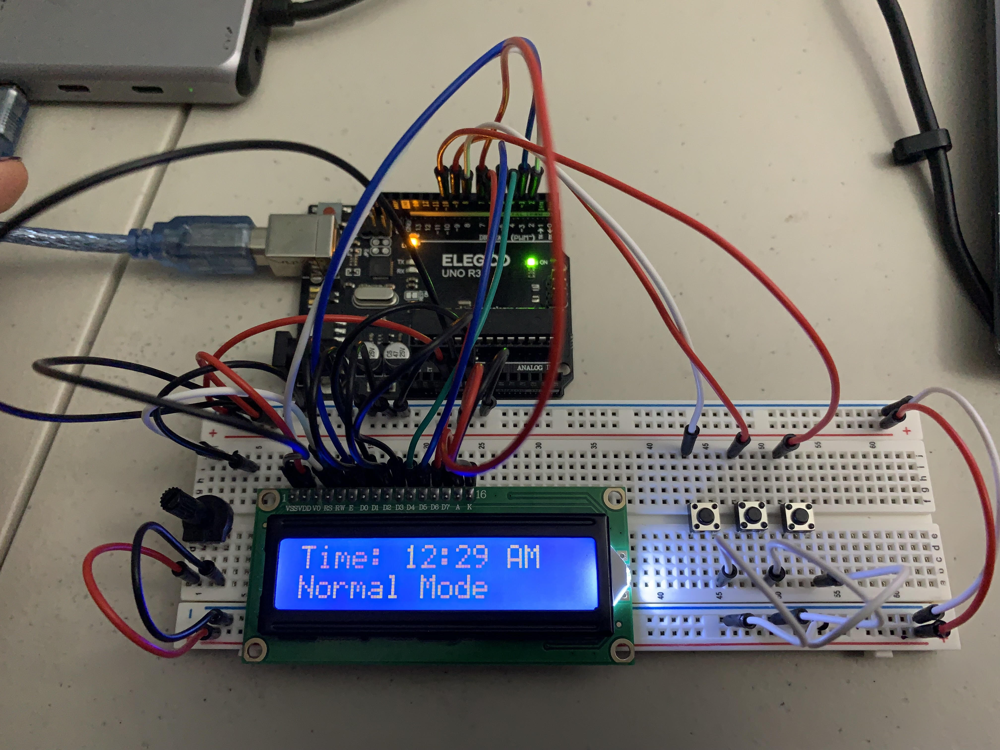

# Arduino Alarm Clock 

## Introduction

This project is a simple digital clock built using an **Arduino** and an **LCD display**. The clock features adjustable hours and minutes and uses buttons to toggle between setting modes. The time automatically updates every minute and supports a **12-hour format with AM/PM indicators**.

  

## Components Used 

* Arduino Board (Uno or any compatible microcontroller)
* 16 x 2 LCD Display with a 12C pin or direct pin connection
* 3 push buttons for setting time
* resistors or potentiometer (optional) 
* breadboard & jumper wire for connectinos

## Wiring Diagram

### LCD to Arduino (Direct Connection):

| LCD Pin | Arduino Pin |
| --- | --- |
| RS | 2 |
| E | 3 |
| D4 | 4 |
| D5 | 5 |
| D6 | 6 |
| D7 | 7 |
| VCC | 5V |
| GND | GND |

### Buttons to Arduino:

| Button | Arduino Pin |
| --- | --- |
| Set Mode | 8 |
| Increment | 9 |
| Decrement | 10 |
> **Note:** The buttons use **INPUT_PULLUP**, meaning they are internally pulled HIGH and active when pressed (LOW state).

## Features

-   Displays time in **12-hour format with AM/PM indicator**.

-   **Button-controlled** setting mode to adjust hours and minutes.

-   **Automatic time update** every 60 seconds.

-   LCD screen displays **"Normal Mode", "Set Hours", and "Set Minutes"** to indicate the active mode.

## Usage Instructions

1.  **Power the Arduino.** The LCD should display **"Simple Clock :)"** momentarily.

2.  **Set the Time:**

    -   Press **Set Button** (Pin 8) to toggle between **Normal Mode, Set Hours, and Set Minutes**.

    -   Press **Up Button (Pin 9)** to increase the selected value.

    -   Press **Down Button (Pin 10)** to decrease the selected value.

3.  The time will **update automatically every minute**.

## Possible Improvements

-   **Add an Alarm Feature** (using a buzzer and an alarm-set mode).

-   **Use a Real-Time Clock (RTC) Module** to retain time even after a reset.

-   **Battery Backup** to prevent resets during power loss.

##

**Author**: Krupa Dave

**Project Version**: 1.0
